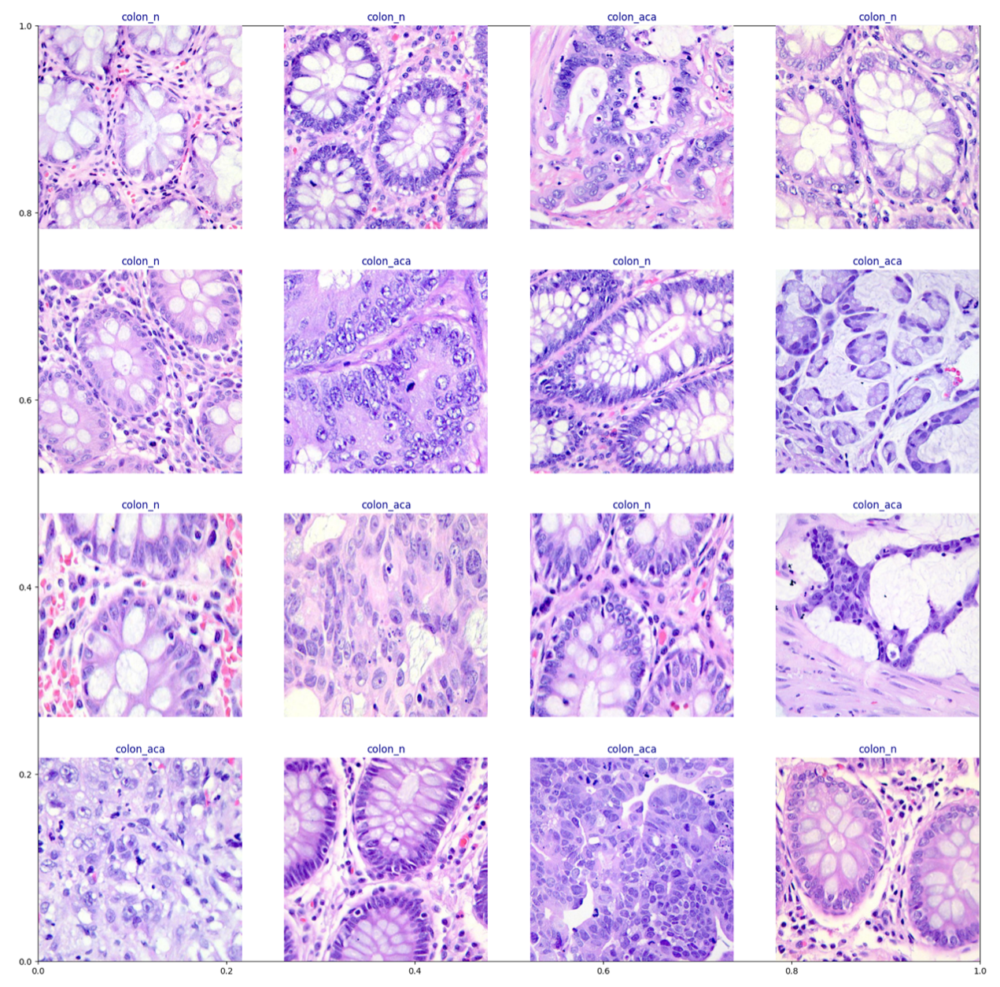

## Colon Cancer Classification using Neural Networks
This project aims to classify images in the given dataset as colon adenocarcinoma or benign colon tissue, making use of convolutional neural networks (CNN) and the PyTorch library.

### Overview:

Currently, diagnostic measures diagnosing colon cancer involves a relatively simple procedure called a colonoscopy. While physicians are generally able to extract potentially cancerous polyps, they cannot tell simply by looking at them whether or not the polyps are cancerous without sending them to the lab for further analysis. It is in the lab where errors can be made when determining the cancerous nature of polyps, since certain polyps may be mistakenly overlooked. In this regard, machine learning holds immense promise for improving the screening efforts of physicians to prevent colorectal cancer cases and improve early-detection efforts. By training a convolutional neural network on existing lab samples of colon tissue, we can hope to accurately identify polyp samples (which are simply extensions of tissue) when they reach the lab. The below graphic contains 16 labelled image samples that were used in the training of the CNN model. "colon-aca" and "colon-n" represent colon adenocarcinoma and benign colon tissue, respectively.

### Results:
- Various model architectures were experimented with, each providing different accuracy on test data
    - Random Forest: 53.3%
    - CNN: 66.7%
    - VGG-16 + Random Forest: 99.0%
    - ResNet + Random Forest: 99.8%
- Best hyperparameters overall
    - SGD optimizer
    - cross-entropy loss
    - lr from 0.004 to 0.04
    - batch size of 32
    - 30 epochs

### Data & Data Processing:

- 10 000 images of colon adenocarcinoma and benign colon tissue
    - training data / validation data split = 80/20
- Various transforms were applied to the image data for better generalization
    - resize to 180 x 180 pixels
    - random horizontal flip
    - random rotation by 10 degrees
    - transform to tensor
    - normalize tensor data

### Try it:

Refer to the [report](report.pdf) and [code](./Code) for further details and analysis.

Try the final model by uploading your own samples [here](https://www.gradio.app/guides/quickstart).

### Acknowledgments:

Borkowski AA, Bui MM, Thomas LB, Wilson CP, DeLand LA, Mastorides SM. Lung and Colon Cancer Histopathological Image Dataset (LC25000). arXiv:1912.12142v1 [eess.IV], 2019
